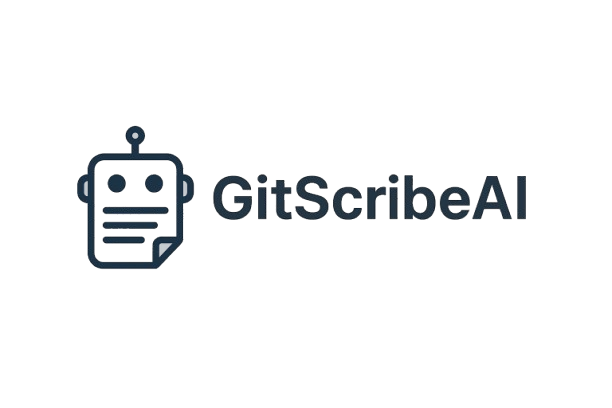

# 🤖 GitScribeAI

<div align="center">
  
</div>

<p align="center">
  
  
  
  
  
  
</p>

<p align="center">
  <a href="https://github.com/sponsors/ChromuSx"></a>
  <a href="https://ko-fi.com/chromus"></a>
  <a href="https://buymeacoffee.com/chromus"></a>
  <a href="https://www.paypal.com/paypalme/giovanniguarino1999"></a>
</p>

<p align="center">
  <strong>GitScribeAI is a command-line tool that automatically generates Git commit messages using OpenAI's artificial intelligence.
  By analyzing staged changes, it produces commit messages that are concise, descriptive, and follow standard conventions.
  </strong>
</p>

---

## ✨ Features

* 📄 Generates commit messages based on Git diffs
* 🧠 Powered by OpenAI models (GPT)
* 📋 Automatically copies the message to clipboard
* ✅ Optional: performs the commit directly
* 🌐 Multi-language support (🇬🇧 English, 🇮🇹 Italian – easily extendable)
* ⚙️ Flexible configuration via `.ini` file or environment variables

---

## 🧰 Requirements

* 🪟 Windows with PowerShell
* 🧬 Git installed and available in `PATH`
* 🔐 A valid OpenAI account and API key
* (Optional) Environment variable `OPENAI_API_KEY` set

---

## 🚀 Installation

1. Clone the repository:

   ```bash
   git clone https://github.com/yourusername/GitScribeAI.git
   ```

2. Create the config file:

   ```bash
   GitScribeAI.bat --create-config
   ```

3. Open `gitscribeai_config.ini` and paste your OpenAI API key

4. (Optional) Add the directory to your system `PATH` to run `GitScribeAI.bat` from anywhere

---

## ⚙️ Configuration

### 📁 Option 1: Config file (`gitscribeai_config.ini`)

```ini
[Settings]
MODEL=gpt-4o
LANGUAGE=english
COMMIT_DIRECTLY=false

[API]
# WARNING: Never commit this file with your real API key!
OPENAI_API_KEY=your_api_key
```

### 🌱 Option 2: Environment variable

```powershell
set OPENAI_API_KEY=your_api_key
```

---

## ▶️ Basic Usage

1. Stage your changes:

   ```bash
   git add modified_file.txt
   ```

2. Run GitScribeAI:

   ```bash
   GitScribeAI.bat
   ```

The generated message will be displayed and copied to the clipboard.
Then commit using:

```bash
git commit -m "the_generated_message"
```

---

## ⚙️ Options

```bash
GitScribeAI.bat [options]
```

| Option            | Description                                      |
| ----------------- | ------------------------------------------------ |
| `--model MODEL`   | Specifies the OpenAI model (default: `gpt-4o`)   |
| `--lang LANGUAGE` | Sets the language (`english` or `italian`)       |
| `--commit`        | Automatically commits with the generated message |
| `--create-config` | Creates a config file with default values        |
| `--help`          | Displays this help message                       |

---

## 📚 Examples

🔸 Generate a message in Italian and commit immediately:

```bash
GitScribeAI.bat --lang italian --commit
```

🔸 Use a different model:

```bash
GitScribeAI.bat --model gpt-3.5-turbo
```

---

## 🔐 Security Tips

* ❗ Never share or commit your OpenAI API key
* ✅ Add `gitscribeai_config.ini` to your `.gitignore`
* 🔒 Prefer environment variables for storing sensitive data
* 💸 Keep in mind: OpenAI API usage may incur costs

---

## 🧩 Add GitScribeAI as a Custom Action in Fork (Windows)

You can integrate `GitScribeAI.bat` into [Fork](https://git-fork.com) to run it with one click:

### 🪟 Steps (Windows only)

1. Open **Fork**

2. Go to **File > Preferences > Custom Actions**

3. Click **Add**

4. Fill in the fields:

   * **Name**: `GitScribeAI`
   * **Script**: `GitScribeAI.bat`
   * **Parameters**: `--lang italian` *(or any combination you prefer)*
   * **Working Directory**: `Repository Directory`

5. Click **OK**

Now you'll find **GitScribeAI** listed under the **Actions** menu in your repository toolbar. Click it to generate and (optionally) commit messages with AI assistance!

---

## 🤝 Contributing

Contributions are welcome!
Feel free to:

* Open an issue
* Submit a pull request

---

## 💖 Support the Project

This project is completely free and open source. If you find it useful and would like to support its continued development and updates, consider making a donation. Your support helps keep the project alive and motivates me to add new features and improvements!

<div align="center">
  <a href="https://github.com/sponsors/ChromuSx"></a>
  <a href="https://ko-fi.com/chromus"></a>
  <a href="https://buymeacoffee.com/chromus"></a>
  <a href="https://www.paypal.com/paypalme/giovanniguarino1999"></a>
</div>

Every contribution, no matter how small, is greatly appreciated! ❤️

---

## 📜 License

This project is licensed under the **MIT License**.

---
